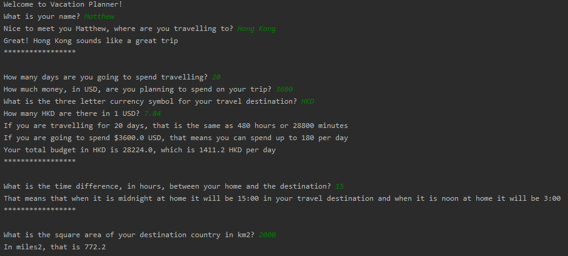

# trip_planner

## Description

A simple Java app from the Microsoft edX Intro to Java course. It is a vacation planner that takes in user input through the command line. See the example below.

## Example

